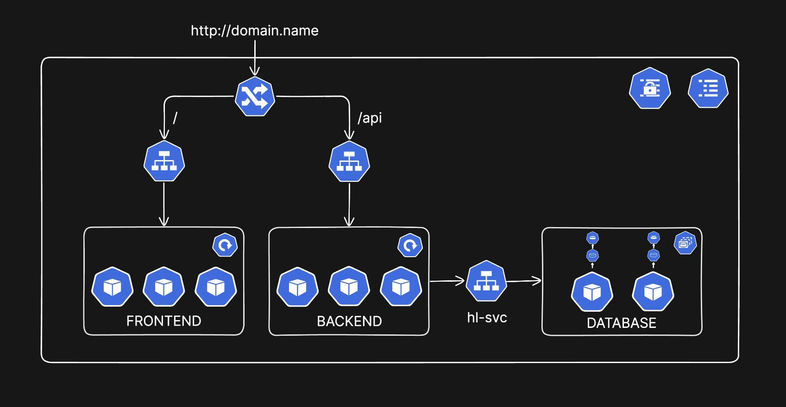

# Kubernetes Multi-Tier Application with Auto-Scaling and StatefulSet

A production-ready Kubernetes deployment featuring a three-tier architecture (Frontend, Backend, Database) with horizontal auto-scaling, MySQL master-slave replication using StatefulSet, and Ingress routing.

---

## Architecture Overview



---

### Components

- **Frontend**: React/Angular/Vue.js application (auto-scaling)
- **Backend**: REST API service (auto-scaling)
- **Database**: MySQL with master-slave replication (StatefulSet)
- **Ingress**: Traffic routing and load balancing
- **HPA**: Horizontal Pod Autoscaler for dynamic scaling

## Current Deployment Status

```bash
FRONTEND:  1/1 pods running (HPA: 1-4 replicas)
BACKEND:   1/1 pods running (HPA: 1-4 replicas)
MYSQL:     2/2 pods running (master-slave)
SERVICES:  frontend-service, backend-service, mysql-hl (headless)
```

--- 

## Key Features

### 1. **MySQL Master-Slave Architecture (StatefulSet)**

- **Master Node (mysql-0)**: Handles INSERT, UPDATE, DELETE operations
- **Slave Node (mysql-1)**: Handles READ operations only
- **Continuous Replication**: Slave synchronizes data from master
- **Stable Network Identity**: Each pod maintains a stable hostname
- **Ordered Deployment**: Pods are created and terminated in order (mysql-0 → mysql-1)

**Access Pattern:**
```bash
# Master (read/write)
mysql-0.mysql-hl.default.svc.cluster.local

# Slave (read-only)
mysql-1.mysql-hl.default.svc.cluster.local
```

### 2. **Horizontal Pod Autoscaling (HPA)**

Both Frontend and Backend support dynamic scaling based on resource utilization:

**Scaling Triggers:**
- CPU usage > 50%: Scale up
- Memory usage > 50%: Scale up
- CPU/Memory < 50%: Scale down

**Scaling Behavior:**
- **Scale Up**: 
  - Execute immediately
  - Can double pods (100% increase)
  - Max: 4 pods
- **Scale Down**: 
  - Wait 5 minutes (stabilization period)
  - Reduce by 50% at once
  - Min: 1 pod

**Current Metrics:**
```
Frontend HPA: CPU: 0%/50%, Memory: 1%/50%  (1/4 replicas)
Backend HPA:  CPU: 0%/50%, Memory: 25%/50% (1/4 replicas)
```

### 3. **Rolling Update Strategy**

Zero-downtime deployments with controlled rollout:

```yaml
strategy:
  type: RollingUpdate
  rollingUpdate:
    maxSurge: 1         # Can create 1 extra pod temporarily
    maxUnavailable: 0   # All pods must remain available
```

**Example:** With 4 replicas:
- Update creates 5th pod → Wait for ready → Terminate 1 old pod
- Repeat until all pods updated
- Never goes below 4 available pods

### 4. **Ingress Routing**

Path-based routing to different services:

```
http://domain.name/      → Frontend Service → Frontend Pods
http://domain.name/api   → Backend Service  → Backend Pods
```

### 5. **Headless Service for StatefulSet**

```yaml
service/mysql-hl   ClusterIP: None   PORT: 3306
```

Benefits:
- Direct pod-to-pod communication
- Stable DNS names for each pod
- No load balancing (direct access to specific pods)

---

## 🚀 Get Going!

## 📁 Project Structure

```
k8s/
├── README.md
├── architecture.png            # Architecture diagram
├── backend/
│   ├── be-config.yml          # Backend ConfigMap
│   ├── be-deployment.yml      # Backend Deployment
│   ├── be-hpa.yml             # Backend Horizontal Pod Autoscaler
│   ├── be-secret.yml          # Backend Secrets (API keys, tokens)
│   └── be-svc.yml             # Backend ClusterIP Service
├── database/
│   ├── db-config.yml          # MySQL master-slave configuration
│   ├── db-secret.yml          # MySQL root password and credentials
│   ├── db-statefulset.yml     # MySQL StatefulSet (master-slave)
│   └── db-svc-hl.yml          # MySQL Headless Service
├── frontend/
│   ├── fe-deployment.yml      # Frontend Deployment
│   ├── fe-hpa.yml             # Frontend Horizontal Pod Autoscaler
│   └── fe-svc.yml             # Frontend ClusterIP Service
└── ingress/
    └── ingress.yml            # Ingress routing rules
```

### Required Minikube Addons

```bash
# Enable Metrics Server (required for HPA)
minikube addons enable metrics-server
# Enable Ingress Controller (required for routing)
minikube addons enable ingress
```

### Complete Deployment (All at Once)

```bash
# Deploy all resources in order
kubectl apply -f database/
kubectl apply -f backend/
kubectl apply -f frontend/
kubectl apply -f ingress/

# Verify deployment
kubectl get all
```

